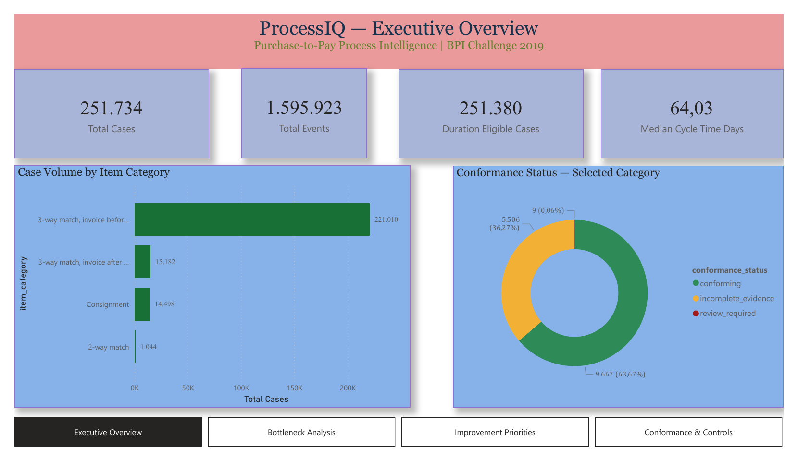

# ProcessIQ — Purchase-to-Pay Process Intelligence

ProcessIQ analyses **251,734 purchase-item cases and 1,595,923 events** from the BPI Challenge 2019 event log. It combines data validation, process mining, statistical comparisons, and a four-page Power BI report to prioritise operational investigations.

**Business question:** Which purchase-to-pay process deviations should an operations manager investigate first to reduce delayed invoice clearing and manual rework without weakening financial controls?

**Status, 8 October 2026:** The Python analysis pipeline and dashboard are implemented. The full pipeline passed on the source dataset, including validation and dashboard checksum checks; all **92 automated tests passed**. Documentation is aligned with code commit `5e191f1`. Recommendations remain investigation proposals; no operational intervention or realised saving has been measured.

[View dashboard PDF](reports/dashboard/ProcessIQ_Dashboard.pdf) · [Executive decision memo](reports/ProcessIQ_Executive_Decision_Memo.pdf) · [Portfolio case study](docs/portfolio-case-study.md) · [Download Power BI report](reports/dashboard/ProcessIQ_Dashboard.pbix) · [Reproduce the analysis](docs/reproducibility.md)

## Main findings

Detailed conformance and bottleneck analysis focuses on **3-way match, invoice after GR**. Conformance covers all **15,182** cases in that category. Duration analysis uses **15,045** eligible cases, with an observed median trace duration of **63.10 days** and P90 of **128.30 days**.

| Investigation priority | Score / band | Evidence |
|---|---|---|
| Payment-block prevention and resolution | 78 / P1 | 2,252 eligible cases carry the marker; median duration is 35.96 days higher than in cases without it. |
| Invoice receipt to clearing | 77 / P1 | The directly-follows transition accounts for 24.32% of observed waiting time; its median wait is 21.96 days. |
| Repeated formal invoice receipts | 75 / P1 | 1,221 eligible cases carry the marker; median duration is 67.46 days higher than in cases without it. |
| Goods receipt to formal invoice receipt | 70 / P2 | 5,360 eligible cases contain this transition; median wait is 19.08 days. |
| Vendor invoice creation to formal receipt | 70 / P2 | 4,886 eligible cases contain this transition; median wait is 20.39 days. |

These are relative decision-support scores, not estimated returns. Marker associations do not establish causation; transition waits can include legitimate payment terms or other expected delays. Case groups overlap, so their reach and duration differences must not be added together.

The separate control review identifies **9 review-required cases**, **9,667 conforming cases**, and **5,506 cases with incomplete evidence**. Incomplete evidence is not classified as a confirmed violation. See [findings and decision cautions](docs/findings.md).

## Delivered work

- Streaming XES profiling and extraction with source event positions retained.
- Structural and count validation, explicit timing exclusions, and analytical tables.
- Process variants, a directly-follows graph, and an Inductive Miner process tree.
- Recorded-order rules separating conforming, review-required, and incomplete-evidence cases.
- Transition waits and seven marker comparisons with Mann–Whitney U tests, Benjamini–Hochberg adjustment, and rank-biserial effects.
- Five ranked investigations with explicit scoring weights and decision cautions.
- Dashboard tables, a manifest, and verification of both dashboard CSV checksums.
- An optional PostgreSQL schema, CSV loader, analytical views, and reconciliation queries.
- A four-page Power BI report, PDF export, and 92 automated tests.

The implemented analysis is process mining and statistical decision support. It does not train a predictive model or use generative AI.

## Dashboard pages

| Page | Purpose | Preview |
|---|---|---|
| Executive Overview | Dataset scope, category volumes, and selected-category conformance | [Image](docs/images/processiq-dashboard-1.png) |
| Bottleneck Analysis | Eligible-case durations, transition waits, and marker associations | [Image](docs/images/processiq-dashboard-2.png) |
| Improvement Priorities | Ranked investigations and decision cautions | [Image](docs/images/processiq-dashboard-3.png) |
| Conformance & Controls | Rule outcomes and separation of incomplete evidence from review cases | [Image](docs/images/processiq-dashboard-4.png) |

The PDF and PNGs are static snapshots. The pipeline regenerates analytical data; refreshing and exporting the Power BI report are separate steps. The export at `03072ab` displays the complete recommendation and caution texts. Some chart labels remain abbreviated and the bottleneck table still scrolls; the [export review](docs/dashboard-review.md) records the remaining layout and metric-label clarifications.

## Run the project

Requirements: Python **3.12**, Bash, and Graphviz for process-model SVGs. Power BI Desktop is needed to edit the PBIX. Direct Python dependency versions are pinned in [pyproject.toml](pyproject.toml). PostgreSQL is optional for the separate SQL path.

From the repository root:

~~~bash
python3.12 -m venv .venv
source .venv/bin/activate
python -m pip install -e .
python -m unittest discover -s tests -v
~~~

Obtain the original XES file using the [source and integrity record](docs/data-source.md), then run:

~~~bash
./scripts/run_pipeline.sh full
~~~

Once extracted CSVs exist, reuse them with:

~~~bash
./scripts/run_pipeline.sh fast
~~~

The successful full run recorded on 8 October 2026 took approximately **2 minutes 33 seconds** on the development machine; this is an observation, not a performance guarantee. Setup, outputs, SQL execution, and Power BI refresh are covered in the [reproducibility guide](docs/reproducibility.md).

## Repository guide

| Location | Contents |
|---|---|
| [src/processiq](src/processiq) | Profiling, extraction, validation, transformation, discovery, conformance, bottleneck, prioritisation, and dashboard modules |
| [scripts](scripts) | Pipeline runner and validation/checksum gates |
| [tests](tests) | Automated tests and small fixtures |
| [sql](sql) | PostgreSQL schema, CSV loading, and analytical views |
| [docs](docs) | Methods, findings, reproduction instructions, data records, and report images |
| [reports/dashboard](reports/dashboard) | Power BI report and four-page PDF |
| data/raw, data/interim, data/processed | Local source and generated data; ignored by Git |
| reports/figures | Generated process-model SVGs; ignored by Git |

## Documentation

- [Executive decision memo](reports/ProcessIQ_Executive_Decision_Memo.pdf) and [editable Markdown](reports/executive-decision-memo.md)
- [Portfolio case study](docs/portfolio-case-study.md)
- [Dashboard export review](docs/dashboard-review.md)
- [Methodology and scoring rules](docs/methodology.md)
- [Findings and recommended investigations](docs/findings.md)
- [Reproducibility and dashboard refresh](docs/reproducibility.md)
- [Dataset source, attribution, and integrity](docs/data-source.md)
- [Structural dataset profile](docs/dataset-profile.md)
- [Data model and implemented tables](docs/data-model.md)
- [Project charter and delivery status](docs/project-charter.md)

## Interpretation limits

One case is a purchase-document **item**, not a whole purchase order or a unique invoice. Cycle time is the recorded first-to-last event span, not necessarily a completed purchase-to-payment duration. Timing eligibility does not imply conformance or completion.

The detailed rules and marker comparisons describe one category in one historical, anonymised log. Missing events, timestamp anomalies, related items within purchase orders, contractual payment terms, and overlapping markers limit causal interpretation. Priority weights and actionability ratings are analyst choices. Financial savings and implemented improvements are outside the evidence produced here.

## Dataset attribution

van Dongen, B. (2019). *BPI Challenge 2019*. 4TU.Centre for Research Data. [Dataset DOI](https://doi.org/10.4121/uuid:d06aff4b-79f0-45e6-8ec8-e19730c248f1). The source dataset is provided under [CC BY 4.0](https://creativecommons.org/licenses/by/4.0/). This attribution concerns the dataset; it does not assign a licence to the repository code.

**Author:** Ajin Babu.
